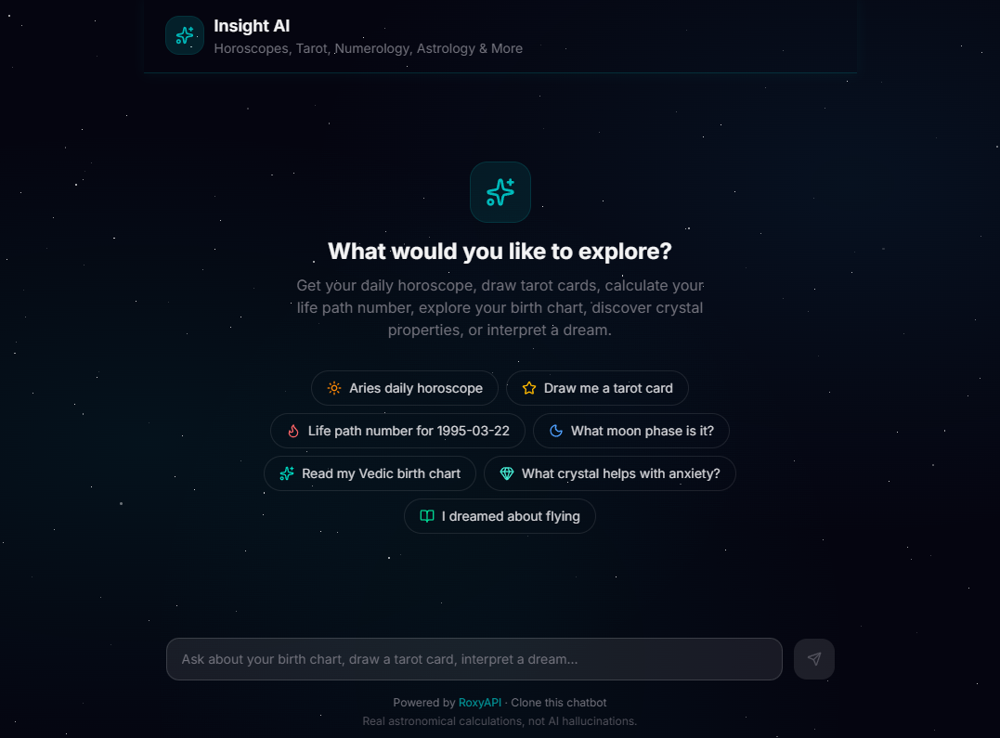
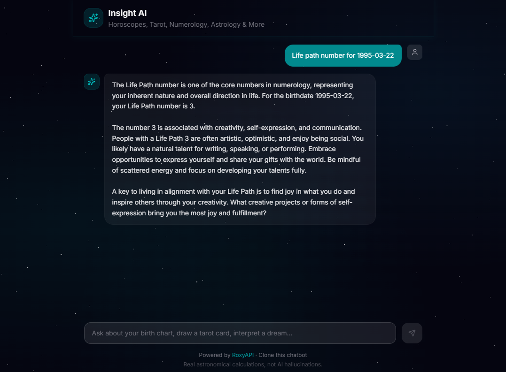

# Insight AI - Astrology, Tarot & Numerology Chatbot

An AI chatbot that gives horoscope readings, draws tarot cards, calculates numerology, interprets dreams, and more — backed by real astronomical calculations via [RoxyAPI](https://roxyapi.com), not LLM hallucinations. Ships with MCP tool discovery, multi-provider LLM support, and a space-themed UI.

**Clone. Add keys. Deploy. Production chatbot in 30 minutes.**





[](https://vercel.com/new/clone?repository-url=https://github.com/RoxyAPI/astrology-ai-chatbot&env=ROXYAPI_KEY,GOOGLE_GENERATIVE_AI_API_KEY&envDescription=API%20keys%20for%20RoxyAPI%20and%20your%20LLM%20provider&envLink=https://roxyapi.com/pricing)

## Why This Exists

Most AI astrology chatbots hallucinate planet positions, make up tarot spreads, and invent numerology results. This one calls [RoxyAPI's 110+ verified endpoints](https://roxyapi.com/docs) via [MCP](https://roxyapi.com/docs/mcp) (Model Context Protocol), gets real computed data from astronomical ephemeris engines and mathematical models, then has the LLM interpret it. Every birth chart, every tarot draw, every Life Path calculation is backed by actual computation.

**8 domains. Auto-discovered tools via MCP. Multilingual. Any LLM.**

| Domain | What You Can Ask |
|--------|-----------------|
| **Horoscopes** | Daily, weekly, monthly horoscopes for all 12 zodiac signs |
| **Tarot** | Three-card spreads, daily card pull, yes/no oracle |
| **Numerology** | Life Path number, expression number, compatibility |
| **Western Astrology** | Natal chart, planetary aspects, moon phases |
| **Vedic Astrology** | Birth chart (Kundli), Vimshottari Dasha, Gun Milan, Panchang |
| **Crystals** | Healing properties, chakra associations, gemstone recommendations |
| **Angel Numbers** | Spiritual meaning of 111, 222, 333, 444, 1111, and more |
| **I-Ching & Dreams** | Hexagram readings, dream symbol interpretation (2,000+ symbols) |

Responds in the user's language automatically — Hindi, Spanish, French, German, Japanese, and more.

## Quick Start

```bash
git clone https://github.com/RoxyAPI/astrology-ai-chatbot.git
cd astrology-ai-chatbot
npm install
cp env.example .env.local
# Add your keys to .env.local
npm run dev
```

Open [localhost:3000](http://localhost:3000) and start chatting.

You need two keys:

| Key | Where to get it |
|-----|----------------|
| **RoxyAPI** | [roxyapi.com/pricing](https://roxyapi.com/pricing) — powers all readings and calculations |
| **LLM** | Google, Anthropic, or OpenAI — interprets the data (see below) |

## Choose Your LLM

Swap providers with one env var. All three use Vercel AI SDK's unified interface — same code, different model:

| Provider | Env Var | Model | Cost / 1M tokens |
|----------|---------|-------|-------------------|
| **Google Gemini** (default) | `GOOGLE_GENERATIVE_AI_API_KEY` | Gemini 2.0 Flash | $0.10 / $0.40 — has free tier |
| Anthropic | `ANTHROPIC_API_KEY` | Claude Haiku 4.5 | $1.00 / $5.00 |
| OpenAI | `OPENAI_API_KEY` | GPT-4o Mini | $0.15 / $0.60 |

```env
LLM_PROVIDER=gemini
GOOGLE_GENERATIVE_AI_API_KEY=your_key
```

## How It Works

```
User message → LLM picks a tool → MCP calls RoxyAPI → Real data returned → LLM interprets → Streams to user
```

1. User asks a question ("What does my Saturn placement mean?")
2. The LLM selects the right tool from 100+ auto-discovered MCP tools
3. [RoxyAPI](https://roxyapi.com) computes the answer from verified astronomical/mathematical engines
4. The LLM interprets the structured data into a natural, personalized response
5. Response streams back in real-time

No prompt-stuffing. No fake data. No hardcoded horoscopes.

## Architecture

```
src/
├── app/
│   ├── api/chat/route.ts    # Chat endpoint — streamText + MCP tools
│   ├── layout.tsx            # Root layout, metadata, JSON-LD SEO
│   ├── page.tsx              # Home page with structured data
│   └── globals.css           # Space theme, star animations, glass UI
├── components/
│   ├── chat/
│   │   ├── ChatPanel.tsx     # Main chat container with useChat
│   │   ├── MessageList.tsx   # Messages, empty state, suggestions
│   │   ├── MessageBubble.tsx # User/assistant message rendering
│   │   └── MessageInput.tsx  # Input field + send button
│   └── StarField.tsx         # Animated star background (CSS)
└── lib/
    ├── ai.ts                 # Multi-provider LLM config (Gemini/Claude/GPT)
    ├── mcp.ts                # MCP client — auto-discovers all RoxyAPI tools
    └── prompts.ts            # System prompt — personality, capabilities, multilingual
```

Key design decisions:
- **MCP over REST** — tools are auto-discovered from RoxyAPI's MCP servers. No manual endpoint definitions. Add new tools on the API side and the chatbot picks them up automatically.
- **Server-side only** — all API keys stay in the Next.js API route. Nothing leaks to the client bundle.
- **Model agnostic** — Vercel AI SDK v6 abstracts the LLM. Swap Gemini for Claude or GPT with one env var.
- **SSR + JSON-LD** — structured data and meta tags render server-side for search engine visibility.

## Stack

| Layer | Tech |
|-------|------|
| Framework | [Next.js 16](https://nextjs.org) (App Router, React 19) |
| AI | [Vercel AI SDK v6](https://ai-sdk.dev) — streaming, tool calling, multi-provider |
| Data | [RoxyAPI](https://roxyapi.com) — 110+ endpoints, 8 domains, native [MCP](https://roxyapi.com/docs/mcp) |
| Tool Discovery | [MCP](https://modelcontextprotocol.io) via `@ai-sdk/mcp` — auto-discovers tools at runtime |
| UI | [Tailwind CSS v4](https://tailwindcss.com) + [shadcn/ui](https://ui.shadcn.com) + custom space theme |
| Types | [openapi-typescript](https://openapi-ts.dev) — generated from RoxyAPI OpenAPI spec |
| SEO | Server-rendered JSON-LD (schema.org), Open Graph, keyword meta tags |

## Customize

**AI personality** — edit [`src/lib/prompts.ts`](src/lib/prompts.ts). Make it mystical, clinical, casual, or match your brand.

**Which domains** — edit the product list in [`src/lib/mcp.ts`](src/lib/mcp.ts). Comment out products you do not need.

**UI theme** — components are in [`src/components/chat/`](src/components/chat/). Star field, colors, and glass effects are in [`globals.css`](src/app/globals.css). Everything is Tailwind — no CSS-in-JS.

**API types** — run `npm run generate:types` to regenerate TypeScript types from the latest [RoxyAPI OpenAPI spec](https://roxyapi.com/docs).

## Deploy

One-click deploy to Vercel:

[](https://vercel.com/new/clone?repository-url=https://github.com/RoxyAPI/astrology-ai-chatbot&env=ROXYAPI_KEY,GOOGLE_GENERATIVE_AI_API_KEY&envDescription=API%20keys%20for%20RoxyAPI%20and%20your%20LLM%20provider&envLink=https://roxyapi.com/pricing)

Or deploy anywhere that runs Node.js:

```bash
npm run build && npm start
```

## Security

- API keys are server-side only — never exposed to the browser
- All RoxyAPI calls happen in the Next.js API route via MCP, not the client
- LLM provider keys are server-side environment variables
- No secrets in the client bundle
- Input validation via MCP tool schemas

## Links

| Resource | URL |
|----------|-----|
| RoxyAPI Homepage | [roxyapi.com](https://roxyapi.com) |
| API Documentation | [roxyapi.com/docs](https://roxyapi.com/docs) |
| MCP Integration | [roxyapi.com/docs/mcp](https://roxyapi.com/docs/mcp) |
| Pricing | [roxyapi.com/pricing](https://roxyapi.com/pricing) |
| All Products | [roxyapi.com/products](https://roxyapi.com/products) |
| Starter Apps | [roxyapi.com/starters](https://roxyapi.com/starters) |

---

Built with [RoxyAPI](https://roxyapi.com) — the data engine behind real astrology, tarot, and numerology calculations.
